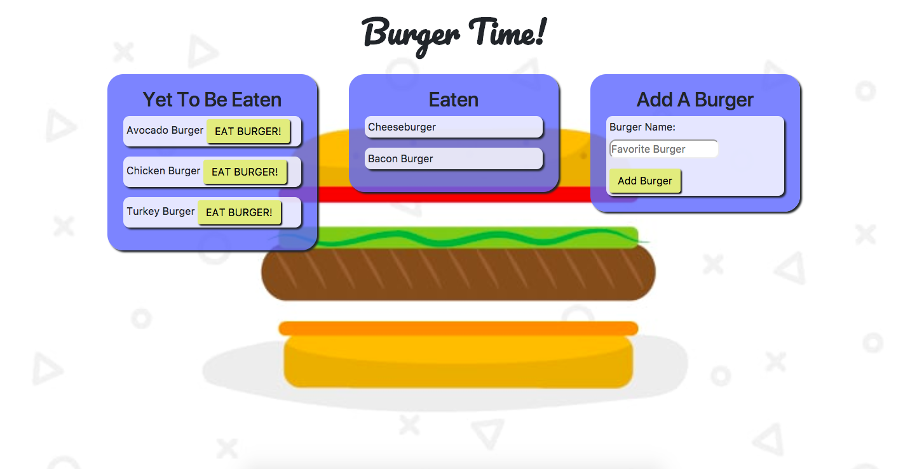

# Burger Time
### This is a fun app that uses MySQL and Handlebars to let the user add any hamburger they want to eat to the database.
### The initial state of the burger is uneaten. Once the user decides to eat the burger, it goes into the eaten box.

